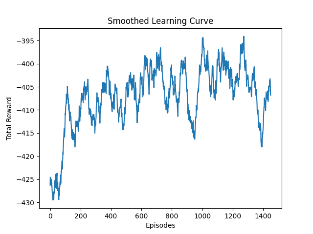

# 🚦 Smart Traffic Signal Optimization using Reinforcement Learning

## 📌 Problem Statement

Urban traffic congestion leads to:

* Increased waiting times ⏳
* Fuel wastage ⛽
* Environmental pollution 🌫️

Traditional traffic signals use **fixed timing**, which cannot adapt to real-time traffic conditions.

---

## 💡 Proposed Solution

This project uses **Reinforcement Learning (Q-learning)** to dynamically optimize traffic signals.

The agent learns to:

* Analyze traffic distribution across lanes
* Select the best lane to give green signal
* Reduce congestion and improve traffic flow

---

## ⚙️ System Overview

* A custom traffic simulation environment is created
* The agent observes lane-wise traffic conditions
* Based on the state, it selects an action (which lane gets green)
* The environment updates and provides reward feedback
* Over time, the agent learns an optimal strategy

---

## 🧠 Model Details

* Algorithm: **Q-Learning (Tabular RL)**
* Strategy: ε-greedy (exploration vs exploitation)
* State: Traffic levels in multiple lanes
* Actions: Choosing which lane to prioritize

---

## 🎯 Reward Function Design

We designed a **multi-objective reward system**:

* Minimize waiting time (reduce congestion)
* Maximize cars passed (increase throughput)
* Penalize unnecessary signal switching
* Prioritize emergency vehicles (ambulance 🚑)

This ensures the model learns **efficient and realistic traffic control behavior**.

---

## 📊 Results

- Random Policy Avg Reward: -421.62
- Q-Learning Avg Reward: -110.56
- Improvement: +311.06
- Final Score: 0.73

👉 The Q-learning agent outperforms a random baseline, showing improved traffic efficiency.

---
## 📊 Training Visualization
This graph shows the learning progress of the Q-learning agent.


---
## 🚀 Key Features

* Adaptive traffic signal control
* Custom simulation environment
* Reward engineering with real-world factors
* Baseline comparison (Random vs Q-learning)
* Lightweight and fast execution

---

## 🛠️ Tech Stack

* Python 🐍
* NumPy
* Reinforcement Learning

---

## 📂 Project Structure

```
main.py              # Runs training and evaluation
q_learning.py        # Q-learning implementation
openenv.yaml         # Environment config (if used)
README.md
```

---

## ▶️ How to Run

### 1. Clone the repository

```
git clone <your-repo-link>
cd <your-project-folder>
```

### 2. Run the project

```
python main.py
```

---

## 📈 Future Improvements

* Deep Q-Networks (DQN)
* Multi-intersection optimization
* Real-time traffic integration
* API-based deployment

---

## 🏆 Hackathon Highlights

* Strong RL-based approach
* Real-world reward design
* Clear improvement over baseline
* Simple and efficient implementation

---

## 👩‍💻 Author

**Priyadarshini**
Aspiring Data Scientist

---

## ⭐ Conclusion

This project demonstrates how **Reinforcement Learning can improve real-world traffic systems** by making them adaptive and intelligent.


